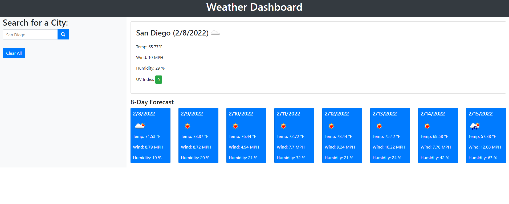

# Weather Dashboard

This is a web application  that uses a [WeatherAPI](https://openweathermap.org/) that allows users to search for a city and retrieve the current weather as well as the forecasted weather. The weather will provide the user with the temperature, humidity, wind speed, and UV index.

[Deployed Site](https://hctyler.github.io/Weather_Dashboard/)

[Github Repo](https://github.com/HCTyler/Weather_Dashboard)

